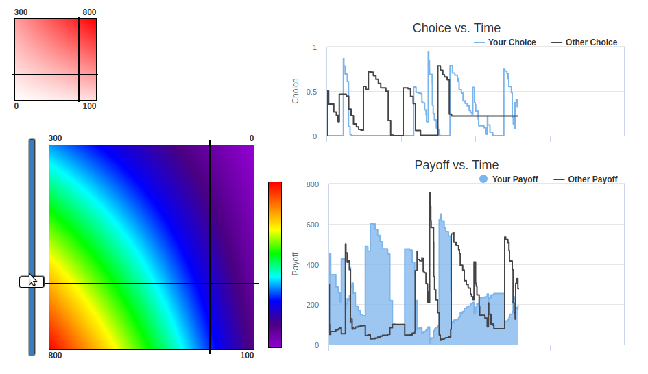
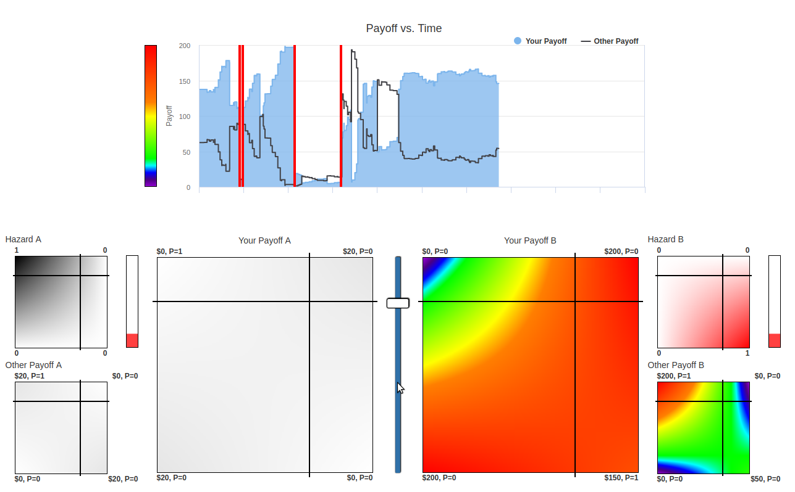
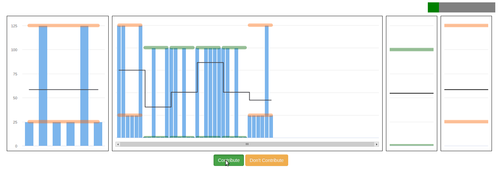

.. _examples:

Examples
========

.. _GeneralBimatrix:

`General Bimatrix <https://github.com/Leeps-Lab/bimatrix>`_
-------------------------------------------------------------------------------------------

The General Bimatrix is a re-implementation of the experiment used in "A
Continuous Dilemma", written in oTree using otree-redwood. The experiment
presents participants with a bimatrix game and lets them select a mixed
strategy. Their strategy is combined with that of a counterpart to calculate a
payoff. The continuous time implementation uses websockets to distribute a
players strategy to their counterpart on the order of 100 milliseconds. This
enables players to respond to strategy changes in real time, possibly dozens of
times over the course of a 2-3 minute period.

.. _StochasticBimatrix:

`Stochastic Bimatrix <https://github.com/Leeps-Lab/stochastic_bimatrix>`_
-------------------------------------------------------------------------------------------

Stochastic Bimatrix is similar to Continuous Bimatrix, but with a twist. The
bimatrix game being played can switch between 2 matrices over the course of a
2-3 minute period. Switching is controlled with a stochastic variable set by
the oTree server and varies based on the players current strategy. Regarding
otree-redwood, this shows off the ability of the oTree server to respond to
websocket events, as opposed to just simply rebroadcasting them to the group.

.. _ImperfectMonitoring:

`Imperfect Monitoring <https://github.com/Leeps-Lab/imperfect_monitoring>`_
---------------------------------------------------------------------------------------------

Imperfect Monitoring is another bimatrix game with a twist. First, participants
can only choose a pure strategy from the 2 alternatives. Second, players are
"locked in" to their strategy choice for a short period of time, on the order
of 5-10 seconds. This shows off more of the ability to send websocket events
and drive complex behavior using some features of the otree-redwood library.